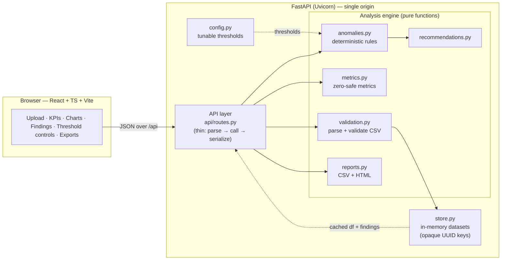
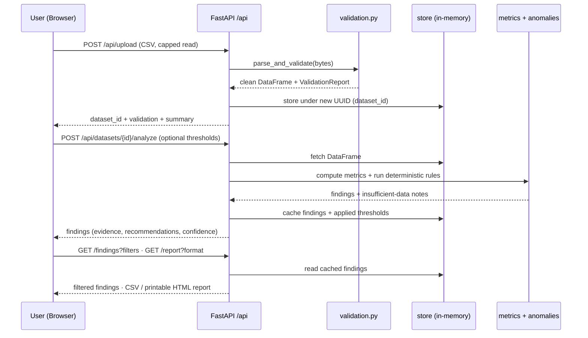

# Campaign Ops Copilot

A lightweight, AI-ready email campaign analytics tool. Upload campaign CSV data (or load
synthetic demo data), and the app calculates key metrics, detects anomalies using
configurable deterministic rules, and generates evidence-based recommendations.

> The tool identifies **potential** problems and suggests what to investigate next. It does
> **not** claim to determine root cause automatically, and it never transmits your data to
> external services.

## Features

- CSV upload with strict validation (required columns, types, dates, numeric ranges, duplicates)
- Aggregate + per-campaign metrics with **documented, zero-safe denominators**
- Deterministic anomaly detection (elevated/spiking bounce, declining replies, repeated issues, incomplete data)
- **Configurable thresholds** — tune every rule from the UI and re-run; the choice is applied to metrics, findings, and reports
- Findings with severity, evidence, plain-English explanation, recommended steps, and confidence
- Interactive dashboard: KPI cards, bounce/reply charts, campaign comparison, filterable findings table
- Exports: campaign summary CSV, findings CSV, print-friendly audit report
- One-click **Demo Mode** with clearly-labeled synthetic data
- No paid APIs, no database, no login — in-memory storage for the MVP

## Tech Stack

- **Frontend:** React, TypeScript, Vite, Tailwind CSS, Recharts, Lucide React
- **Backend:** Python, FastAPI, Pydantic, Pandas
- **Testing:** pytest, Vitest, React Testing Library

## Architecture

The app is a single deployable unit: a React SPA served by the FastAPI backend,
which runs a **pure, modular analysis engine** over uploaded data. Business logic
is decoupled from transport (HTTP) and storage (in-memory), so the engine can be
unit-tested directly and the store could later be swapped for a database without
touching the analysis code.



### Request / data flow

From upload to findings, one path through the system:



## Project Structure

```
campaign-ops-copilot/
├── backend/
│   ├── app/
│   │   ├── main.py            # FastAPI app + OpenAPI config
│   │   ├── config.py          # Thresholds / tunable rule configuration
│   │   ├── models.py          # Pydantic request/response models
│   │   ├── store.py           # In-memory dataset store (opaque IDs)
│   │   ├── api/routes.py      # API endpoints
│   │   ├── analysis/
│   │   │   ├── validation.py  # CSV parsing + validation
│   │   │   ├── metrics.py     # Pure metric functions (zero-safe)
│   │   │   ├── anomalies.py   # Deterministic anomaly rules
│   │   │   ├── recommendations.py
│   │   │   └── reports.py     # CSV + print-friendly report generation
│   │   └── data/sample.py     # Synthetic sample data generator
│   ├── tests/                 # pytest suite
│   └── requirements.txt
├── frontend/
│   └── src/                   # React app (components, api client, types)
├── docs/
│   ├── ARCHITECTURE.md
│   └── METRICS.md             # Metric definitions + limitations
└── sample_data/campaigns_sample.csv
```

## Getting Started

### Backend

```bash
cd backend
python -m venv .venv
# Windows PowerShell:
.venv\Scripts\Activate.ps1
# macOS/Linux:
# source .venv/bin/activate
pip install -r requirements.txt
uvicorn app.main:app --reload --port 8000
```

- API base: `http://localhost:8000/api`
- Interactive OpenAPI docs: `http://localhost:8000/docs`

### Frontend

```bash
cd frontend
npm install
npm run dev
```

- App: `http://localhost:5173` (proxies `/api` to the backend on port 8000)

### Tests

```bash
# Backend
cd backend && pytest

# Frontend
cd frontend && npm test
```

## API Endpoints

| Method | Path | Description |
| ------ | ---- | ----------- |
| GET  | `/api/health` | Service status |
| POST | `/api/upload` | Upload + validate a CSV |
| POST | `/api/demo` | Load synthetic demo dataset |
| GET  | `/api/datasets/{id}/summary` | Aggregate metrics |
| GET  | `/api/datasets/{id}/campaigns` | Per-campaign analytics |
| GET  | `/api/config/thresholds` | Default thresholds + UI metadata |
| POST | `/api/datasets/{id}/analyze` | Run anomaly detection (optional `thresholds` override in body) |
| GET  | `/api/datasets/{id}/findings` | Retrieve + filter findings |
| GET  | `/api/datasets/{id}/report` | Downloadable report (csv / findings / html) |

## Documentation

- [`docs/ARCHITECTURE.md`](docs/ARCHITECTURE.md) — system design, layering, request flow, scaling path.
- [`docs/METRICS.md`](docs/METRICS.md) — exact metric definitions, denominators, thresholds, and limitations.

## Tests

- Backend: 33 pytest tests covering validation, metrics (incl. zero denominators),
  anomaly detection (incl. insufficient-data handling and determinism), and the API.
- Frontend: Vitest + React Testing Library tests for the findings table (filtering,
  expansion, status updates, empty state).

## Deployment (free)

The app ships as a **single Docker container**: the React build is compiled and
served by the FastAPI backend from the same origin, so the frontend's `/api`
calls work with no CORS or extra configuration.

### Recommended: Render (free tier)

1. Push this repo to GitHub.
2. On [Render](https://render.com): **New → Blueprint**, select the repo. It reads
   [`render.yaml`](render.yaml) and deploys the `Dockerfile` as one free web service.
3. Open the service URL — the dashboard and API are both there (`/` and `/api`).

> Note: Render's free tier sleeps after ~15 minutes idle and takes ~30–60s to wake.
> For a live demo, open the URL a minute beforehand to warm it up. (Free-tier terms
> change over time; verify current limits on Render's site.)

### Run the production container locally

```bash
docker build -t campaign-ops-copilot .
docker run -p 8000:8000 campaign-ops-copilot
# open http://localhost:8000
```

Any Docker-capable host (Fly.io, a VPS, etc.) works the same way; the container
listens on `$PORT` (default 8000).

## Data Handling & Limitations

- Uploaded data is treated as untrusted and validated before use.
- File size is capped (see `config.py`).
- Data is stored **in memory only** — it is lost on restart and is not shared across worker processes.
- Nothing is transmitted to third-party services; no API keys required.
- See [`docs/METRICS.md`](docs/METRICS.md) for exact metric definitions and known limitations.
